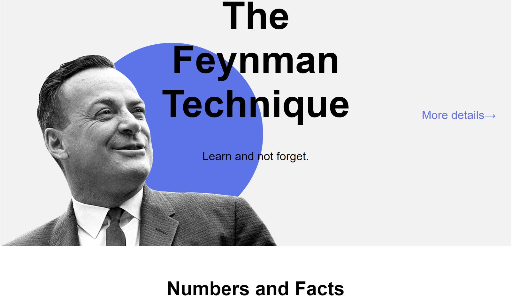

# Y. Practicum - "Learning How to Learn" landing page solution

This is a solution to the "Learning How to Learn" landing page project on the web development course.

## Table of contents

- [Overview](#overview)
  - [The challenge](#the-challenge)
  - [Screenshot](#screenshot)
  - [Links](#links)
- [My process](#my-process)
  - [Built with](#built-with)
  - [What I learned](#what-i-learned)
  - [Useful resources](#useful-resources)

## Overview

### The challenge

Users should be able to:

- View the optimal layout for the page
- See hover states for all interactive elements on the page
- Navigate the page and view each section

### Screenshot



### Links

- Live Site URL: [alexbulgakov.github.io/how-to-learn/](https://alexbulgakov.github.io/how-to-learn/)

## My process

### Built with

- Semantic HTML5 markup
- Nested BEM-notation
- CSS custom properties
- Flexbox
- Animations
- iframes

### What I learned

I've learned to use CSS animations and Nested BEM for web development. For example, in a layout with

```html
<section class="khan"></section>
```

```css
.khan {
}
```

the khan is the main block. Inside, elements like

```html
<div class="khan__container"></div>
```

```css
.khan__container {
  /* styles */
}
```

and

```html
<p class="khan__author"></p>
```

```css
.khan__author {
  /* styles */
}
```

follow the BEM structure, indicating they are parts of the khan block. This approach organizes CSS more efficiently and animations bring the page to life, enhancing user interaction.

### Useful resources

- [About BEM notation](https://en.bem.info/) - This helped me for BEM reason. I really liked this methodology and will use it going forward.
